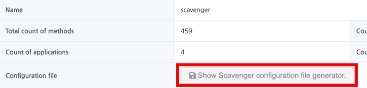

# Installation Guide

## Prerequisite

- Scavenger is a combination of various server components(API, Frontend, Collector) and agent component.
  To install scavenger, you need JDK 11 or latest version.
- Scavenger uses 3 ports. if some ports are blocked by your firewall, you should ask the network admin to open the
  following ports in the firewall.
  These ports can be configured by the configuration.
    - Agent: Any ===> Collector: This is dependent on your tomcat configuration. By default, it is set as 9090.
    - Agent: Any ===> Collector: This is dependent on your grpc configuration. By default, it is set as 8080.
    - API: This is dependent on your tomcat configuration. By default, it is set as 8081.

## Install Collector

#### Build Collector

Download Collector from the following link.
https://github.com/naver/scavenger/releases
> Or, You can also build it by yourself. <br/>
> 1. Build Scavenger manually from the Git clone.
> 2. Run `./gradlew assemble -p scavenger-collector`

#### Installation

Start Collector using the following command.

- e.g) `java -jar scavenger-collector-boot.jar`

#### Configuration

You can override any configuration values with `-D` option.

- `java -jar -Dgrpc.server.port=8080 scavenger-collector-boot.jar`

To change the http(default 9090) and grpc(default 8080) ports used by Collector, you can change the settings below.

- `server.port`: Tomcat uses 9090 by default
- `grpc.server.port`: grpc uses 8080 by default

Collector provide `local` profile.</br>
profile enables `spring.profiles.active` and enables the below configuration.</br>
The collector uses H2 in its local profile. If you've built your own MySQL, you can change the four settings below.

- `spring.datasource.url`
- `spring.datasource.username`
- `spring.datasource.password`
- `spring.datasource.driver-class-name`

If you changed `grpc.server.port`, you must also change the settings below to the same value as `grpc.server.port`.

- `scavenger.grpc-direct-access-port`

##### When Building Manually

You can modify default configuration values or add new profiles under `scavenger-collector/src/main/resources/`.

## Install API

#### Build API

Download API from the following link.
https://github.com/naver/scavenger/releases
> Or, You can also build it by yourself. <br/>
> 1. Build Scavenger manually from the Git clone.
> 2. Run `./gradlew assemble -p scavenger-api`

#### Installation

Start API using the following command.
When you start the API, you need to set the value `scavenger.collector-server-url` with the `-D` option so that the API
knows the collector's url.

- e.g) `java -Dscavenger.collector-server-url=http://localhost:8080 -jar scavenger-api-boot.jar`

#### Configuration

You can override any configuration values with `-D` option.

- `java -jar scavenger-api-boot.jar`

To change the http(default 8080) ports used by API, you can change the settings below.

- `server.port`: Tomcat uses 8080 by default

Collector provide `local` profile.</br>
profile enables `spring.profiles.active` and enables the below configuration.</br>
The collector uses H2 in its local profile. If you've built your own MySQL, you can change the four settings below.

- `spring.datasource.url`
- `spring.datasource.username`
- `spring.datasource.password`
- `spring.datasource.driver-class-name`

##### When Building Manually

You can modify default configuration values or add new profiles under `scavenger-api/src/main/resources/`.

## Install Agent

## Build Agent

Download Agent from the following link.
주소 추가 예정

> You can also build it yourself. <br/>
> 1. Build Scavenger manually from the Git clone.
> 2. Run `./gradlew assemble -p scavenger-agent-java`

#### Configuration

- By default, this is done using the `scavenger.conf` file.
- It can also be configured via Java system properties and environment variables, but the agent is developed in such a
  way that it will not work if the `scavenger.conf` file does not exist.
- Therefore, it is recommended to use scavenger.conf as the default and only to override settings.
- The `scavenger.conf` can be set and downloaded via the UI.



- Example `scavenger.conf`

```properties
apiKey=eb99ff0f-aaaa-bbbb-cccc-5d1ec81f6183
serverUrl=http://10.106.93.41:8081
environment=dev
appName=apiserver
codeBase=webapps/ROOT/WEB-INF
packages=com.navercorp
```

- Scavenger configuration

| configuration         | default     | Description                                                                                                                                                                                                                                                                                                                                                                                                                                                                                                                                                                                                                                                                                                                                                                                                                                                                                                                                                                                                                                                                                                                                                                                                                                                                                                                                                                                                                                                                                                                                                                                                                                                                                                                                                                                        |
|-----------------------|-------------|----------------------------------------------------------------------------------------------------------------------------------------------------------------------------------------------------------------------------------------------------------------------------------------------------------------------------------------------------------------------------------------------------------------------------------------------------------------------------------------------------------------------------------------------------------------------------------------------------------------------------------------------------------------------------------------------------------------------------------------------------------------------------------------------------------------------------------------------------------------------------------------------------------------------------------------------------------------------------------------------------------------------------------------------------------------------------------------------------------------------------------------------------------------------------------------------------------------------------------------------------------------------------------------------------------------------------------------------------------------------------------------------------------------------------------------------------------------------------------------------------------------------------------------------------------------------------------------------------------------------------------------------------------------------------------------------------------------------------------------------------------------------------------------------------|
| enabled               | true        | <li>Option to enable or disable Scavenger.</li>                                                                                                                                                                                                                                                                                                                                                                                                                                                                                                                                                                                                                                                                                                                                                                                                                                                                                                                                                                                                                                                                                                                                                                                                                                                                                                                                                                                                                                                                                                                                                                                                                                                                                                                                                    |
| apiKey (*)            |             | <li>The key used to identify the project.</li><li> ex) ec69466e-aaaa-bbbb-cccc-3021386f997e </li>                                                                                                                                                                                                                                                                                                                                                                                                                                                                                                                                                                                                                                                                                                                                                                                                                                                                                                                                                                                                                                                                                                                                                                                                                                                                                                                                                                                                                                                                                                                                                                                                                                                                                                  |
| serverUrl (*)         |             | <li>URL of the Scavenger collector to send collection data to.</li><li>ex) http://collector-test.scavenger.navercorp.com </li>                                                                                                                                                                                                                                                                                                                                                                                                                                                                                                                                                                                                                                                                                                                                                                                                                                                                                                                                                                                                                                                                                                                                                                                                                                                                                                                                                                                                                                                                                                                                                                                                                                                                     |
| appName (*)           |             | <li>A name for the application.</li> <li>  ex) foo_apiserver  </li>                                                                                                                                                                                                                                                                                                                                                                                                                                                                                                                                                                                                                                                                                                                                                                                                                                                                                                                                                                                                                                                                                                                                                                                                                                                                                                                                                                                                                                                                                                                                                                                                                                                                                                                                |
| packages (*)          |             | <li>a list of packages to scan. Packages are separated by , and all subpackages are scanned.</li><li>ex) io.scavenger.javaagent, io.scavenger.dashboard</li>                                                                                                                                                                                                                                                                                                                                                                                                                                                                                                                                                                                                                                                                                                                                                                                                                                                                                                                                                                                                                                                                                                                                                                                                                                                                                                                                                                                                                                                                                                                                                                                                                                       |
| codeBase              |             | <li>In Scavenger, a codebase is a representation of the code being scaned at the time of collection. If you change the content of the code you're scaning, or change settings such as which packages are scaned, Scavenger will treat it as a new codebase and upload it. When a new codebase is uploaded, new methods are inserted and methods from the old codebase are removed by a garbage collector that runs at regular intervals. Each method is identified using a signature, which is a function signal Call information is also recorded dependent on the method in each codebase, so call information for methods whose signatures have not changed is preserved between codebase uploads.</li><li>This option specifies the location of the codebase. If not specified, the Scavenger agent will use the default classpath of the class loader to scan for classes. If your application loads classes on its own from a path other than the default classpath, such as Tomcat, you must explicitly specify this option as shown in the example below for proper ingestion. In your respective deployment environment, you can set this option as follows.</li><ol><li> jar file(executable jar) - Specify a directory containing a single JAR file, or specify the JAR file itself. ex) path/to/example.jar</li><li> extracted jar(layertools) - Specify /lib, /classes in BOOT-INF ex) BOOT-INF/lib, BOOT-INF/classes</li><li> war file(web archive) - Specify the WEB-INF directory. ex) path/to/WEB-INF</li><li>Gradle worksapce - build/libs/</li><li> Maven workspace - target/</li></ol> <liIf you're using Tomcat, you can specify the path to the webapp where the code you want to scan resides, such as `codeBase = /home1/irteam/service/tomcat/webapps/ROOT/WEB-INF`.</li> |
| excludePackages       |             | <li>Specifies which of the subpackages specified in packages you want to exclude from tracking.</li><li>ex) foo.bar, baz.qux</li>                                                                                                                                                                                                                                                                                                                                                                                                                                                                                                                                                                                                                                                                                                                                                                                                                                                                                                                                                                                                                                                                                                                                                                                                                                                                                                                                                                                                                                                                                                                                                                                                                                                                  |
| annotations           |             | <li>Target sub methods of the annotated class to scan.</li><li>ex) @org.springframework.web.bind.annotation.RestController, @org.springframework.stereotype.Controller</li>                                                                                                                                                                                                                                                                                                                                                                                                                                                                                                                                                                                                                                                                                                                                                                                                                                                                                                                                                                                                                                                                                                                                                                                                                                                                                                                                                                                                                                                                                                                                                                                                                        |
| additionalPackages    |             | <li>Specifies the packages excluded by annotations that you want to include in the scan.</li><li>ex) io.scavenger.javaagent, io.scavenger.dashboard</li>                                                                                                                                                                                                                                                                                                                                                                                                                                                                                                                                                                                                                                                                                                                                                                                                                                                                                                                                                                                                                                                                                                                                                                                                                                                                                                                                                                                                                                                                                                                                                                                                                                           |
| methodVisibility      | protected   | <li>Filter what to scan based on the access controller of the method. Values are public, protected, package-private, and private, with the cost increasing the further back you go. Package-private and private are unlikely to be used in practice, as they can be easily removed using static code analysis in the IDE.</li>                                                                                                                                                                                                                                                                                                                                                                                                                                                                                                                                                                                                                                                                                                                                                                                                                                                                                                                                                                                                                                                                                                                                                                                                                                                                                                                                                                                                                                                                     |
| excludeConstructors   | false       | <li>Specifies whether constructors should be excluded from scaning. For Spring applications, we recommend setting this to true to exclude constructors of beans from collection because they are called automatically.</li>                                                                                                                                                                                                                                                                                                                                                                                                                                                                                                                                                                                                                                                                                                                                                                                                                                                                                                                                                                                                                                                                                                                                                                                                                                                                                                                                                                                                                                                                                                                                                                        |
| excludeGetterSetter   | false       | <li>Specifies whether getters and setters should be excluded from scaning. Methods in the form of componentN() that are created by the data class of your Kotlin are also excluded. These are often automatically generated by libraries like Lombok, so we recommend setting them to true to exclude them from collection.</li>                                                                                                                                                                                                                                                                                                                                                                                                                                                                                                                                                                                                                                                                                                                                                                                                                                                                                                                                                                                                                                                                                                                                                                                                                                                                                                                                                                                                                                                                   |
| asyncCodeBaseScanMode | false       | <li>Scavenger first aggregates the codebase before instrumentation. This causes your application to be delayed from booting by Scavenger. We recommend setting this to true after you have verified that your Scavenger settings are working properly.</li>                                                                                                                                                                                                                                                                                                                                                                                                                                                                                                                                                                                                                                                                                                                                                                                                                                                                                                                                                                                                                                                                                                                                                                                                                                                                                                                                                                                                                                                                                                                                        |
| environment           | <default>   | <li>Specifies the application environment values. This can be used if you maintain different codebases for different deployment stages, as they are collected as if they were separate codebases based on that value.</li><li>ex) dev / alpha / beta / real</li><li>In the Scavenger UI, data collected in separate environments can be specified multiple times when taking a snapshot to check for dead code all at once.</li>                                                                                                                                                                                                                                                                                                                                                                                                                                                                                                                                                                                                                                                                                                                                                                                                                                                                                                                                                                                                                                                                                                                                                                                                                                                                                                                                                                   |
| appVersion            | unspecified | <li>Specify the application version. This option does not affect collection. Instead, it is useful if you want to specify which version of the application you are scaning.</li><li>ex) 1.0.0</li>                                                                                                                                                                                                                                                                                                                                                                                                                                                                                                                                                                                                                                                                                                                                                                                                                                                                                                                                                                                                                                                                                                                                                                                                                                                                                                                                                                                                                                                                                                                                                                                                 |
| hostname              |             | <li>Specifies that it should be recorded differently from the existing hostname. This option does not affect ingestion, but can be useful when determining which host the agent ran on.</li>                                                                                                                                                                                                                                                                                                                                                                                                                                                                                                                                                                                                                                                                                                                                                                                                                                                                                                                                                                                                                                                                                                                                                                                                                                                                                                                                                                                                                                                                                                                                                                                                       |
| debugMode             | false       | <li>You can check the logs to see which methods are being traced and whether they are being called. Enabling this mode will have a serious impact on the performance of your application, and we do not recommend using it outside of a development environment.</li>                                                                                                                                                                                                                                                                                                                                                                                                                                                                                                                                                                                                                                                                                                                                                                                                                                                                                                                                                                                                                                                                                                                                                                                                                                                                                                                                                                                                                                                                                                                              |

#### Installation

- Setting up the agent via `-javaagent:path/to/scavenger-agent.jar`
- Specify the config file via `-Dscavenger.configuration=path/to/scavenger.conf`

```bash
export JAVA_OPTS="$JAVA_OPTS -Dscavenger.configuration=$CATALINA_BASE/conf/scavenger.conf"
export JAVA_OPTS="$JAVA_OPTS -javaagent:/home1/irteam/scavenger-agent.jar"
```
